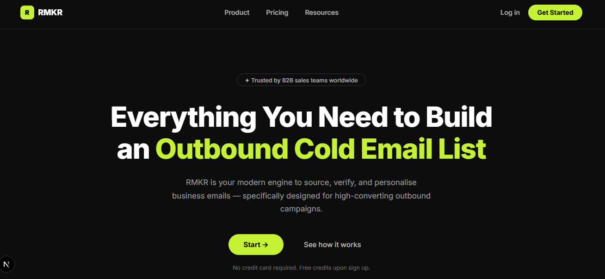

# RMKR — AI-Powered B2B Lead Scraping SaaS

 *(Preview of the landing page)*

**Live Demo:** [https://rmkr.netlify.app/](https://rmkr.netlify.app/)

RMKR is a full-stack, production-ready B2B lead generation platform. It automatically sources, verifies, and personalises business emails specifically designed for high-converting outbound campaigns. Simply type a natural language query (e.g., "Find me 50 marketing managers in New York"), and the system handles the rest.

## Features

- **Intelligent Scraping Pipeline:** Primary scraping engine via Apify with an automated, seamless fallback to Apollo.io to bypass free-tier rate limits.
- **AI Query Translation:** Uses Anthropic Claude (primary) and Google Gemini (fallback) to instantly translate natural language search queries into strict, complex API filter payloads.
- **AI-Powered Personalisation:** Automatically generates hyper-personalised, spartan-toned cold email icebreakers for every lead based on their role, industry, and company.
- **Robust Email Verification:** Dual-layer verification through AnyMailFinder and Prospeo integrations to ensure near-zero bounce rates.
- **Full Authentication & Storage:** Integrated with Supabase Auth (Email/Password) and PostgreSQL for managing user accounts, configurations, and persistent order history.
- **Premium UI/UX:** Built with React, Next.js (App Router), and a custom "Midnight Luxe" dark-theme design system.

## Tech Stack

- **Framework:** Next.js 16 (App Router)
- **Language:** TypeScript
- **Database & Auth:** Supabase
- **AI Providers:** Anthropic (`claude-sonnet-4-5`), Google Generative AI (`gemini-2.5-flash`)
- **Scraping APIs:** Apify, Apollo.io
- **Verification APIs:** AnyMailFinder, Prospeo
- **Styling:** Vanilla CSS Modules

## Getting Started

### Prerequisites
- Node.js (v20+)
- A Supabase Project
- API Keys for the respective integrations (Anthropic, Gemini, Apify, Apollo)

### Installation

1. **Clone the repository:**
   ```bash
   git clone <repository-url>
   cd lead-scraping-saas
   ```

2. **Install dependencies:**
   ```bash
   npm install
   ```

3. **Set up Environment Variables:**
   Create a `.env.local` file in the root directory and add your Supabase credentials:
   ```env
   NEXT_PUBLIC_SUPABASE_URL=your_supabase_url
   NEXT_PUBLIC_SUPABASE_ANON_KEY=your_supabase_anon_key
   ```

4. **Database Setup:**
   Run the SQL statements found in `supabase/schema.sql` within your Supabase SQL editor to create the necessary `configs` and `orders` tables.

5. **Run the Development Server:**
   ```bash
   npm run dev
   ```
   Open [http://localhost:3000](http://localhost:3000) to view the application.

## Usage

1. Sign up for an account.
2. Navigate to the **Configuration** page to securely add your API keys (Anthropic/Gemini for AI, Apify/Apollo for scraping).
3. Go to **Scrape Leads**, enter your target demographic, and hit Start.
4. The system will handle data fetching, verification, and AI personalization asynchronously.
5. Export your enriched lead list from the **Orders** page as a CSV.

## License
Copyright © 2026 RMKR. All rights reserved.
